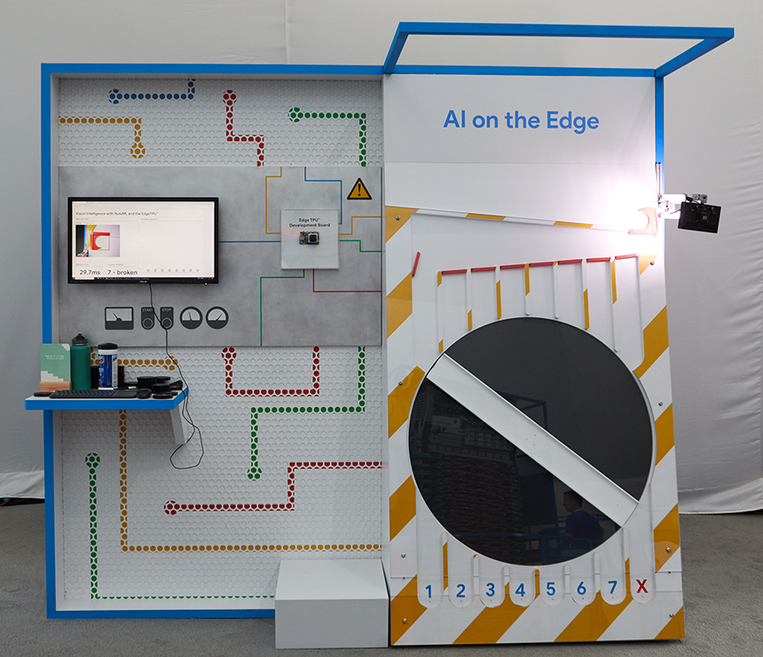

## This repo contains the source control for a demo we created to show off machine learning on the edge using the [Edge TPU Development Board](coral.withgoogle.com/products/dev-board) made by the Coral team (internal Google hardware team).

This is a [video](https://www.youtube.com/watch?v=ryPz6atrU3M) of it in action at the workshop where we were doing work on it just prior to Google Cloud Next 2019.

The source code is split into folders representing the different links in the architecture that piece together the whole thing. The demo uses a webcam, connected via USB-C to the Coral board, which is running a Python script pulling frames from the camera, and passing them through to our models. The models' output is then sent to a secondary machine (we had all them networked over a LAN with a router) which is running a Node.js script. That script does a few things:

1) Business logic for interpreting the model output and deciding which bucket the gear is dropped into.
2) Drives the Arduino which controls the mechanicals of the demo.
3) Sends telemetry data to a Cloud Firestore instance which is then picked up by the Dashboard.

The Coral board also forwards the video stream from the webcam to a Python process running on the secondary machine. The streaming Python script on the secondary machine also saves off an image buffer of the last "captured" gear with bounding box displaying the missing gear detected, both available to be shown in the Dashboard.

**_android/Sorting_Demo_**: This is the folder for the Android application used at Google I/O 2019 to show off AutoML's model compiled down to mobile device and showing off the ability to use the same model on multiple formats of devices accurately.

**_base_training_images_**: Holder folder for any images we take and need to transfer between places for training our model. Heavily depending upon lighting changes, etc to be accurate.

**_dashboard_**: Front-end UI code for displaying the dashboard which is shown on the monitor attached to the demo.

**_coral_**: Code that lives and runs on the Edge TPU development board.

**_server_**: Code that lives and runs on the Windows Lenovo box. The node.js code that has all the business logic for what to do with the outputs from our AutoML model, as well as running the mechanicals of the demo itself by way of the Arduino.

**_imgs_**: Contain footage/images of the demo in action.